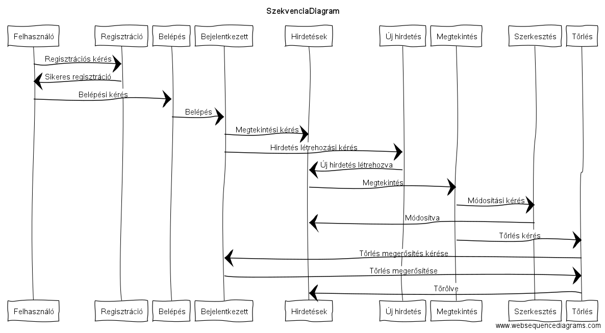

# 1. Beadandó - 1. Feladat vállalása
## Tót Enikő (B1CSMQ)
---
###**1. Követelményanalízis**

####**1.1. Célkitűzés**
Az oldal célja oktatással kapcsolatos kurzusok, tanulmányi vagy korrepetációs órák meghirdetését és azokra való jelentkezést biztosító felület. A kurzusok és órák kategóriánként lennének felsorolva, melyek között vendégként szabad a böngészés. 
Az órákra való jelentkezés, illetve saját óra meghirdetése regisztrációhoz kötött. Felhasználó által feladott hirdetés ellenőrzéshez lenne kötve. Erre azért van szükség, hogy nem oktatás alá tartozó vagy oda nem illő hirdetés ne kerüljön fel, illetve biztosan megfelelő kategóriába kerüljön az adott hirdetés.

####**1.2. Funkcionális követelmények**

* Vendég:
  * Hirdetések böngészése
  * Hirdetések leírásának megtekintése
  * Keresés
  * Regisztrálás

* Felhasználó:
  * Bejelentketés
  * Adatok szerkesztése
  * Hirdetés feladása
  * Saját hirdetés módosítása, törlése

####**1.3. Nem funkcionális követelmények**

+ Felhasználóbarát: áttekinthetőség - kategóriánkénti rendezés
+ Biztonság: jelszóval védett tartalom - jelszavak tárolása - korlátozott hozzáférés
+ Karbantarthatóság: bővíthető/szűkíthető szerkezet - logikus elrendezés

####**1.4. Szakterületi fogalomjegyzék**

+ *Oktatás*: ismeretek elsajátítása, a műveltség megszerzése, intellektuális képességek kialakítása és fejlesztése
+ *Kurzus*: tanulmányok tervezett sorozata
+ *Korrepetáció*: valamilyen tananyagból előkészítő, begyakoroltató, tanulásban segítő folyamat
+ *Hirdetés*: információkat adó leirás egy termékről vagy szolgáltatásról

####**1.5. Szerepkörök**

+ Vendég: hirdetések keresését, böngészését, megtekintését végezheti
+ Felhasználó: a *Vendég* szerepkörén túl saját hirdetések kezelésére képes

####**1.6. Használati-eset model**

####**1.7. Folyamat eset model**

Az alábbi ábra azt a folyamatot reprezentálja, mikor a már regisztrált felhasználó új hirdetést ad fel. Ilyenkor ellenőrzéshez van kötve a hirdetés, hogy az megfelelő-e vagy sem. Amennyiben az nem megfelelő, új hirdetést kell feladni.

# 2. Beadandó - 2. Alkalmazás elkészítése szerveroldali technológiával
---
###**2. Tervezés**

####**2.1. Architektúra terv**

####**2.1.1. Oldaltérkép**

**Publikus**

+ *Főoldal*
  * Hirdetés megtekintése
+ *Bejelentkezés*
+ *Regisztráció*
+ *Böngészés*

**Bejelentkezett**

+ *Főoldal*
  * Hirdetés megtekintése
  * Hirdetés szerkesztése
  * Hirdetés törlése
+ *Új hirdetés*
+ *Böngészés*
+ *Kilépés*

####*2.1.2. Végpontok*

+ *GET/fo:* Főoldal
+ *GET/advertises/:id:* Hirdetések felületei
+ *GET/belep:* Bejelentkezési  felület
+ *POST/belep:* Bejelentkezési adatok felküldése
+ *GET/reg:* Regisztrációs felület
+ *POST/reg:* Regisztrációs adatok felküldése
+ *GET/search:* Böngésző felület
+ *GET/fo/fo:* Főoldal elérése
+ *GET/fo/:id:* Adott hirdetés elérése a főoldalról
+ *GET/fo/belep:* Belépési felület elérése
+ *GET/fo/belep:* Bejelentkezési adatok felküldése
+ *GET/fo/reg:* Regisztrációs felület elérése
+ *POST/fo/reg:* Regisztrációs adatok felküldése
+ *GET/fo/search:* Böngésző felület elérése
+ *GET/advertises/fo:* Főoldal elérése
+ *GET/advertises/belep:* Belépési felület elérése
+ *POST/advertises/belep:* Bejelentkezési adatok felküldése
+ *GET/advertises/reg:* Regisztrációs felület elérése
+ *POST/advertises/reg:* Regisztrációs adatok felküldése
+ *GET/advertises/search:* Böngésző felület elérése
+ *GET/belepett:* Bejelentkezett felhasználói főoldal
+ *GET/belepett/search:* Bejelentkezett felhasználói kereső felület
+ *GET/belepett/uj:* ÚJ hirdetés felvételi felülete
+ *POST/belepett/uj:* Új hirdetési adatok felküldése
+ *GET/belepett/:id/mod:* Adott hirdetés szerkesztési felülete
+ *POST/belepett/:id/mod:* Hirdetés módosított adatainak felküldése
+ *GET/belepett/:id/delete:* Adott hirdetés törlése
+ *GET/belepett/exit:* Kilépés
+ *GET/belepett/advertises/:id:* Adott hirdetés megjelenítése
+ *GET/belepett/advertises/exit:* Kilépés

####**2.2. Felhasználóifelület-modell**

####**2.2.1. Oldalvázlatok és designterv (végső kinézet)**
+ *Főoldal*

+ *Hirdetés megtekintése*

+ *Belépő oldal*

+ *Regisztrációs oldal*

+ *Böngésző oldal*

+ *Saját hirdetés megtekintése*

+ *Szerkesztő oldal*

+ *Új hirdetés felvétele*

####**2.3.Osztálymodell**

####**2.3.1. Adatmodell**

####**2.3.2. Adatbázisterv**

# 3. Beadandó - 3. A szerveroldali alkalmazás progresszív fejlesztése kliensoldali JavaScript segítségével
---
###**3. Implementáció**

####**3.1. Szekvenciadiagram**

####**3.2. Könyvtárstruktúrában lévő mappák funkciójának bemutatása**
+ app->Http : Ajax-os funkciókhoz szükséges kiegészítések
  * routes.js :  további szükséges végpontok felvétele
+ app->Http->Controllers
  * AdvertiseController.js : 
    * ajaxDelete : a hirdetés Ajax-os törlését végzi
  * UserController.js : 
    * ajaxLogin : belépés Ajax-szal
    * ajaxReg : regisztrálás Ajax-szal
+ public->scripts : az 5 funkcióhoz szükséges kiegészítések
  * delete.js : Ajax-os törlés biztosítása
  * index.js
    * a kategóriák sávjára kattintás hatására összecsukódik az alatta található lista
    * a kategória neve mellett zárójelben megjelenik, hogy hány hirdetés található az adott kategóriában
  * popup.js : bejelentkező felület felugró ablakkal való megvalósítása
  * regel.js : regisztrációs felület felugró ablakkal való megvalósítása

+ resources->views : kliensoldali funkciók működéséhez szükséges kiegészítések
Az alábbi fájlok módosításai a fenti scriptek importálásában változtak.
Ezen kívül az űrlapok küldés gombja le van tiltv addig, amíg a felhasználó ki nem töltötte az összes olyan mezőt, ami a fejlesztő által kötelezően kitöltendő kategóriában van meghatározva.
  * advertiseMod.njk 
  * advertiseSearch.njk
  * advertiseShow.njk
  * layout.njk
  * main.njk
  * newAdvertise.njk
  * reg.njk

###**4. Tesztelés**

Maga a tesztelés az órán is használt Selinium IDE-val történt.
A teszteléshez tartozó mentett fájlok a *test* nevű mappában találhatók.
A tesztelés során az alapvető funkciók lettek ellenőrizve.

*
*
*
*

###**5. Felhasználó dokumentáció**

####**5.1. A futtatáshoz ajánlott hardver-, szoftver konfiguráció**
+ **Futtatáshoz szükséges operációs rendszer:** Tetszőlegesen bármilyen operációs rendszer használható
+ **A futtastáshoz szükséges hardver:** Az operációs rendszerek szerint van megadva
+ **Egyéb:** Internetes böngésző, JavaScript, illetve az alkalmazás által használt össze kiegészítőket tartalmazó fájlok telepítése ajánlott

####**5.2. Telepítés lépései: hogyan kerül a Githubról a célgépre a program, hogyan kell elindítani**
+ **1. lépés**
Egy konzol, azaz Parancssor nyitása a gépen
+ **2. lépés**
*git clone https://github.com/anystone1234/alkfejlbead* parancs kiadása
+ **3. lépés**
*npm run dev* parancs kiadása
+ **4. lépés**
Böngészőben *localhost:3333/fo* megnyitása

####**5.3. A program használata**

Az előző pontban leírt lépések után egyből a Főoldalon áll a felhasználó.

+ Itt rá lehet kattintani a kilistázott hirdetésekre. Ha a kategória sávjára kattint a felhasználó, akkor az alatta található lista összecsukódik. Ez újabb kattintás hatására jelenik meg újra.

+ A Böngészés feliratra kattintva pontosan lehet hirdetést keresni. Meg lehet adni a hirdetés nevét, kategóriáját vagy a felhasználók nevét, mint keresési paramétert. A Szűrés gombra kattintva fog megtörténni maga a keresés.
Ezután a találatok száma és maguk a találatok is meg fognak jelenni a kereső sáv alatt.

+ A Regisztráció lehetőségre kattintva lehet beregisztrálni az oldalra. A felhasználónak meg kell adnia egy felhasználónevet, e-mail címet, egy jelszót, amit természetesen biztonsági okoból meg kell erősítenie.
Ha az illető már regisztrálva van, akkor elegendő a Belépés opcióra kattintani, ahol az e-mail cím és jelszó páros megadásával tud belépni az oldalra.

+ Belépés után az Új hirdetés menüpontra kattintva tud a regisztrált felhasználó saját hirdetést létrehozni. A szükséges adatok megadása után a Küldés gombbal tudja véglegesíteni a hirdetését.
Későbbiekben a már létrehozott hirdetésre kattintva az alul található Módosít gombbal tudja módosítani, illetve a Töröl gombbal tudja törölni azt.

+ A Kilépés lehetőséggel tud a bejelentkezett felhasználó kijelentkezni.