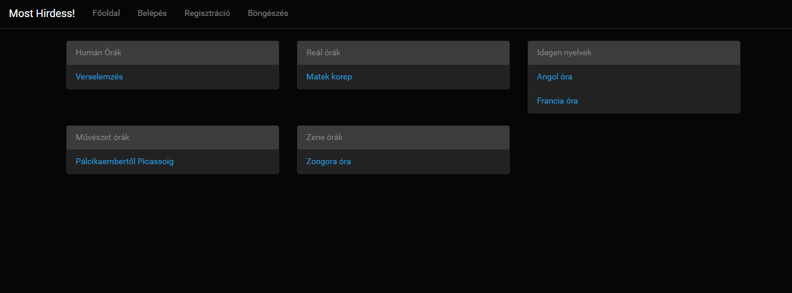
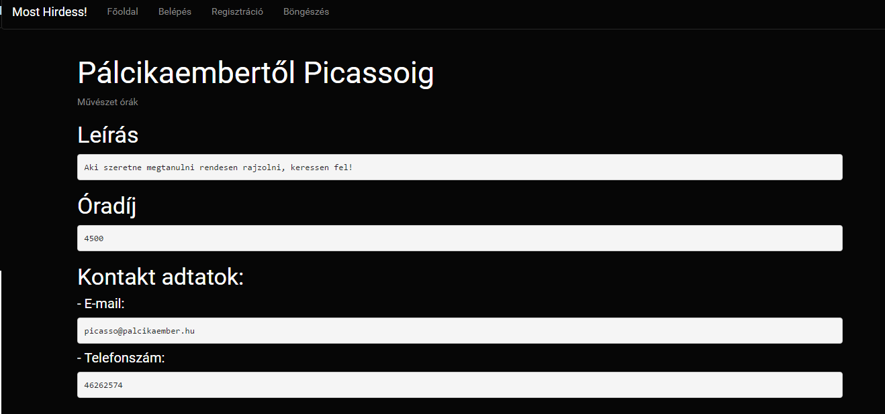
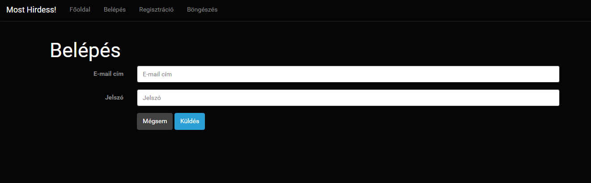
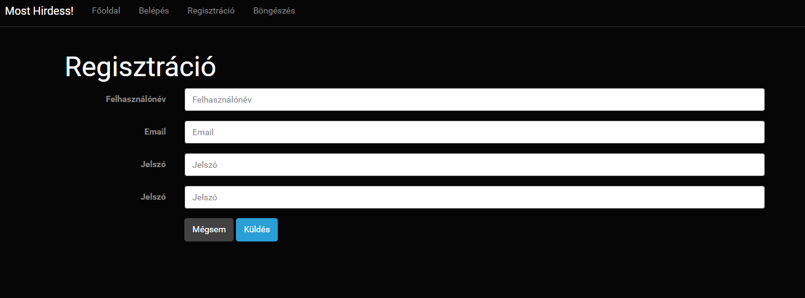
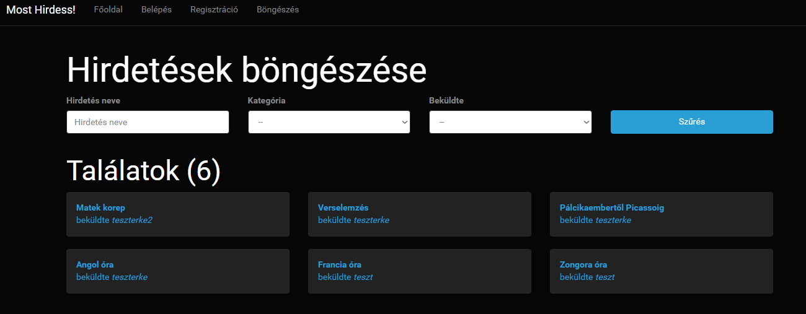
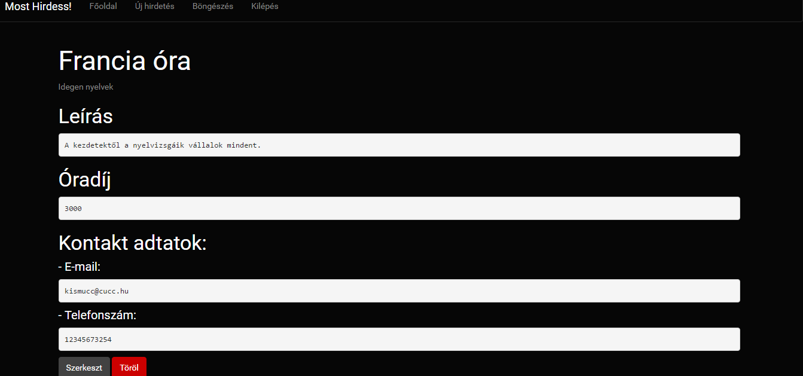
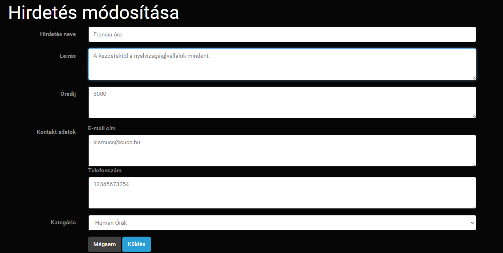
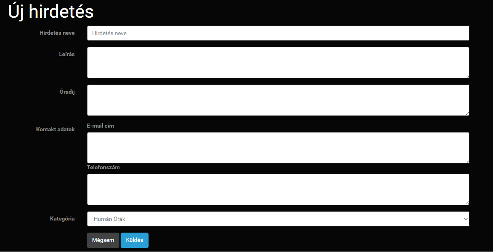
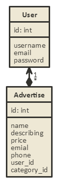
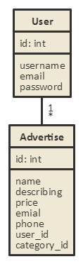

# 1. Beadandó - 1. Feladat vállalása
## Tót Enikő (B1CSMQ)
---
###**1. Követelményanalízis**

####**1.1. Célkitűzés**
Az oldal célja oktatással kapcsolatos kurzusok, tanulmányi vagy korrepetációs órák meghirdetését és azokra való jelentkezést biztosító felület. A kurzusok és órák kategóriánként lennének felsorolva, melyek között vendégként szabad a böngészés. 
Az órákra való jelentkezés, illetve saját óra meghirdetése regisztrációhoz kötött. Felhasználó által feladott hirdetés ellenőrzéshez lenne kötve. Erre azért van szükség, hogy nem oktatás alá tartozó vagy oda nem illő hirdetés ne kerüljön fel, illetve biztosan megfelelő kategóriába kerüljön az adott hirdetés.

####**1.2. Funkcionális követelmények**

* Vendég:
  * Hirdetések böngészése
  * Hirdetések leírásának megtekintése
  * Keresés
  * Regisztrálás

* Felhasználó:
  * Bejelentketés
  * Adatok szerkesztése
  * Hirdetés feladása
  * Saját hirdetés módosítása, törlése

####**1.3. Nem funkcionális követelmények**

+ Felhasználóbarát: áttekinthetőség - kategóriánkénti rendezés
+ Biztonság: jelszóval védett tartalom - jelszavak tárolása - korlátozott hozzáférés
+ Karbantarthatóság: bővíthető/szűkíthető szerkezet - logikus elrendezés

####**1.4. Szakterületi fogalomjegyzék**

+ *Oktatás*: ismeretek elsajátítása, a műveltség megszerzése, intellektuális képességek kialakítása és fejlesztése
+ *Kurzus*: tanulmányok tervezett sorozata
+ *Korrepetáció*: valamilyen tananyagból előkészítő, begyakoroltató, tanulásban segítő folyamat
+ *Hirdetés*: információkat adó leirás egy termékről vagy szolgáltatásról

####**1.5. Szerepkörök**

+ Vendég: hirdetések keresését, böngészését, megtekintését végezheti
+ Felhasználó: a *Vendég* szerepkörén túl saját hirdetések kezelésére képes

####**1.6. Használati-eset model**

####**1.7. Folyamat eset model**

Az alábbi ábra azt a folyamatot reprezentálja, mikor a már regisztrált felhasználó új hirdetést ad fel. Ilyenkor ellenőrzéshez van kötve a hirdetés, hogy az megfelelő-e vagy sem. Amennyiben az nem megfelelő, új hirdetést kell feladni.

# 2. Beadandó - 2. Alkalmazás elkészítése szerveroldali technológiával
---
###**2. Tervezés**

####**2.1. Architektúra terv**

####**2.1.1. Oldaltérkép

**Publikus**

+ *Főoldal*
  * Hirdetés megtekintése
+ *Bejelentkezés*
+ *Regisztráció*
+ *Böngészés*

**Bejelentkezett**

+ *Főoldal*
  * Hirdetés megtekintése
  * Hirdetés szerkesztése
  * Hirdetés törlése
+ *Új hirdetés*
+ *Böngészés*
+ *Kilépés*

####*2.1.2. Végpontok*

+ *GET/fo:* Főoldal
+ *GET/advertises/:id:* Hirdetések felületei
+ *GET/belep:* Bejelentkezési  felület
+ *POST/belep:* Bejelentkezési adatok felküldése
+ *GET/reg:* Regisztrációs felület
+ *POST/reg:* Regisztrációs adatok felküldése
+ *GET/search:* Böngésző felület
+ *GET/fo/fo:* Főoldal elérése
+ *GET/fo/:id:* Adott hirdetés elérése a főoldalról
+ *GET/fo/belep:* Belépési felület elérése
+ *GET/fo/belep:* Bejelentkezési adatok felküldése
+ *GET/fo/reg:* Regisztrációs felület elérése
+ *POST/fo/reg:* Regisztrációs adatok felküldése
+ *GET/fo/search:* Böngésző felület elérése
+ *GET/advertises/fo:* Főoldal elérése
+ *GET/advertises/belep:* Belépési felület elérése
+ *POST/advertises/belep:* Bejelentkezési adatok felküldése
+ *GET/advertises/reg:* Regisztrációs felület elérése
+ *POST/advertises/reg:* Regisztrációs adatok felküldése
+ *GET/advertises/search:* Böngésző felület elérése
+ *GET/belepett:* Bejelentkezett felhasználói főoldal
+ *GET/belepett/search:* Bejelentkezett felhasználói kereső felület
+ *GET/belepett/uj:* ÚJ hirdetés felvételi felülete
+ *POST/belepett/uj:* Új hirdetési adatok felküldése
+ *GET/belepett/:id/mod:* Adott hirdetés szerkesztési felülete
+ *POST/belepett/:id/mod:* Hirdetés módosított adatainak felküldése
+ *GET/belepett/:id/delete:* Adott hirdetés törlése
+ *GET/belepett/exit:* Kilépés
+ *GET/belepett/advertises/:id:* Adott hirdetés megjelenítése
+ *GET/belepett/advertises/exit:* Kilépés

####**2.2. Felhasználóifelület-modell**

####**2.2.1. Oldalvázlatok és designterv (végső kinézet)**
+ *Főoldal*

+ *Hirdetés megtekintése*

+ *Belépő oldal*

+ *Regisztrációs oldal*

+ *Böngésző oldal*

+ *Saját hirdetés megtekintése*

+ *Szerkesztő oldal*

+ *Új hirdetés felvétele*

####**2.3.Osztálymodell**

####**2.3.1. Adatmodell**

####**2.3.2. Adatbázisterv**

####**2.3.3. Állapotdiagram**

